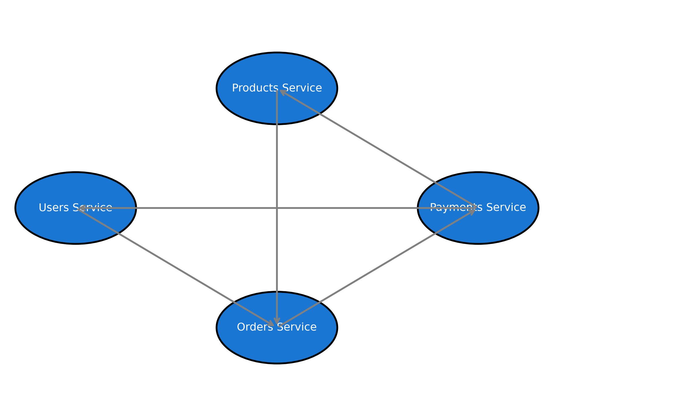

# G1 - Arquitetura de Microserviços

Este projeto implementa **4 microserviços independentes**, cada um com seu próprio banco de dados, rodando em **Docker Compose**.

---

## 🚀 Serviços

### **Users Service**

* Porta: `3004`
* Banco: `usersdb` (Postgres)
* Funcionalidades:

  * CRUD de clientes (nome e email)
  * Endpoint de notificação (`POST /users/:id/notify`)

---

### **Products Service**

* Porta: `3001`
* Banco: `productsdb` (Postgres)
* Funcionalidades:

  * CRUD de produtos
  * Estoque só pode ser atualizado via endpoint específico (`PATCH /products/:id/estoque`)

---

### **Orders Service**

* Porta: `3002`
* Banco: `orders` (MongoDB)
* Funcionalidades:

  * Criação de pedidos vinculados a clientes
  * Consulta de pedidos por cliente
  * Atualização de status (`AGUARDANDO PAGAMENTO`, `PAGO`, `FALHA NO PAGAMENTO`, `CANCELADO`)

---

### **Payments Service**

* Porta: `3003`
* Banco: `paymentsdb` (Postgres)
* Funcionalidades:

  * Criação de pagamentos
  * Processamento de pagamentos (`PATCH /payments/:id/process`)
  * Integração com **Orders** e **Products**
  * Notificação de cliente em caso de sucesso/falha

---

## 🐳 Como rodar

1. Subir a infraestrutura:

   ```sh
   docker compose up --build -d
   ```

2. Rodar migrations (para serviços SQL):

   ```sh
   docker compose run --rm users-service npx prisma migrate dev --name init
   docker compose run --rm products-service npx prisma migrate dev --name init
   docker compose run --rm payments-service npx prisma migrate dev --name init
   ```

3. Rodar seed (opcional):

   ```sh
   docker compose run --rm users-service npm run prisma:seed
   docker compose run --rm products-service npm run prisma:seed
   docker compose run --rm payments-service npm run prisma:seed
   ```

---

## 📖 Documentação Swagger

* Users Service → [http://localhost:3004/swagger](http://localhost:3004/swagger)
* Products Service → [http://localhost:3001/swagger](http://localhost:3001/swagger)
* Orders Service → [http://localhost:3002/swagger](http://localhost:3002/swagger)
* Payments Service → [http://localhost:3003/swagger](http://localhost:3003/swagger)

---

## 🔎 Testes com Postman

Importar a collection:
[`g1_microservices.postman_collection.json`](./g1_microservices.postman_collection.json)

Endpoints principais:

### Users

* `GET /users`
* `POST /users`
* `GET /users/:id`
* `POST /users/:id/notify`

### Products

* `GET /products`
* `POST /products`
* `GET /products/:id`
* `PUT /products/:id` (não altera estoque)
* `PATCH /products/:id/estoque`

### Orders

* `POST /order-service/v1/orders`
* `GET /order-service/v1/orders/:id`
* `GET /order-service/v1/orders`
* `PATCH /order-service/v1/orders/:id/status`

### Payments

* `POST /payments`
* `PATCH /payments/:id/process`

---

## 🛠️ Tecnologias

* Node.js 20 + Express
* Prisma ORM (nos serviços SQL)
* PostgreSQL + MongoDB
* Swagger (swagger-ui-express + swagger-jsdoc)
* Axios (com timeout de 10s para evitar falha em cascata)
* Docker & Docker Compose

---

## 📂 Estrutura de pastas

```
users/
  src/index.js
  prisma/schema.prisma
  prisma/seed.js
  Dockerfile
  package.json

products/
  src/index.js
  prisma/schema.prisma
  prisma/seed.js
  Dockerfile
  package.json

payments/
  src/index.js
  src/utils/api.js
  prisma/schema.prisma
  prisma/seed.js
  Dockerfile
  package.json

orders/
  src/index.js
  src/swagger.js
  Dockerfile
  package.json

docker-compose.yml
README.md
g1_microservices.postman_collection.json
docs/microservices_architecture_v2.png
```

---

## 🔗 Por que microserviços?

* **Escalabilidade**: cada serviço pode ser escalado individualmente.
* **Isolamento de falhas**: se um serviço cai, os demais continuam funcionando.
* **Banco especializado**: SQL para consistência forte (users, products, payments) e NoSQL para flexibilidade (orders).
* **Time-to-market**: diferentes times podem evoluir cada domínio em paralelo.
* **Evolução independente**: código mais enxuto e fácil de manter.

---

## 🏗️ Diagrama da Arquitetura



---

## 📂 g1_microservices.postman_collection.json

```json
{
  "info": {
    "name": "G1 Microservices",
    "_postman_id": "1234-5678-9012-3456",
    "description": "Collection para testar Users, Products, Orders e Payments",
    "schema": "https://schema.getpostman.com/json/collection/v2.1.0/collection.json"
  },
  "item": [
    {
      "name": "Users",
      "item": [
        { "name": "List Users", "request": { "method": "GET", "url": "http://localhost:3004/users" } },
        { "name": "Create User", "request": { "method": "POST", "url": "http://localhost:3004/users", "body": { "mode": "raw", "raw": "{ \"name\": \"Brayan\", \"email\": \"brayan@example.com\" }" } } }
      ]
    },
    {
      "name": "Products",
      "item": [
        { "name": "List Products", "request": { "method": "GET", "url": "http://localhost:3001/products" } },
        { "name": "Create Product", "request": { "method": "POST", "url": "http://localhost:3001/products", "body": { "mode": "raw", "raw": "{ \"name\": \"Teclado\", \"price\": 250.0, \"stock\": 10 }" } } }
      ]
    },
    {
      "name": "Orders",
      "item": [
        { "name": "List Orders", "request": { "method": "GET", "url": "http://localhost:3002/order-service/v1/orders" } },
        { "name": "Create Order", "request": { "method": "POST", "url": "http://localhost:3002/order-service/v1/orders", "body": { "mode": "raw", "raw": "{ \"clientId\": 1, \"products\": [{ \"productId\": 1, \"quantity\": 2 }] }" } } }
      ]
    },
    {
      "name": "Payments",
      "item": [
        { "name": "Create Payment", "request": { "method": "POST", "url": "http://localhost:3003/payments", "body": { "mode": "raw", "raw": "{ \"orderId\": 1, \"amount\": 500.0 }" } } },
        { "name": "Process Payment", "request": { "method": "PATCH", "url": "http://localhost:3003/payments/1/process" } }
      ]
    }
  ]
}
```
